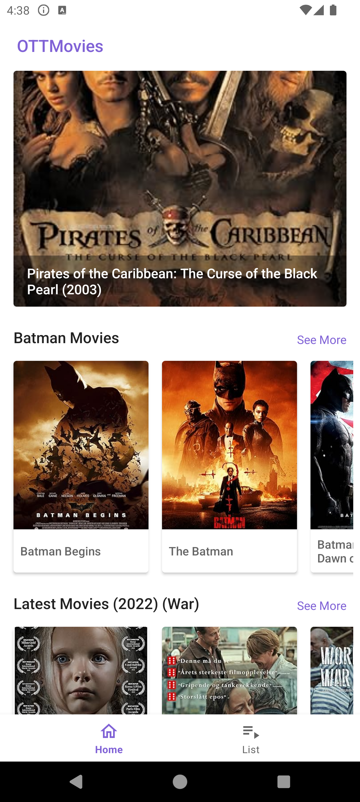
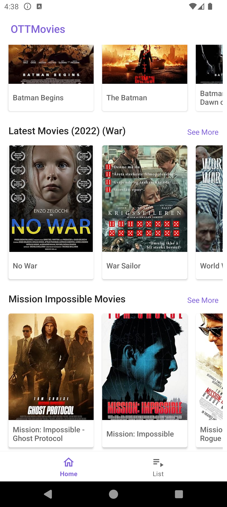
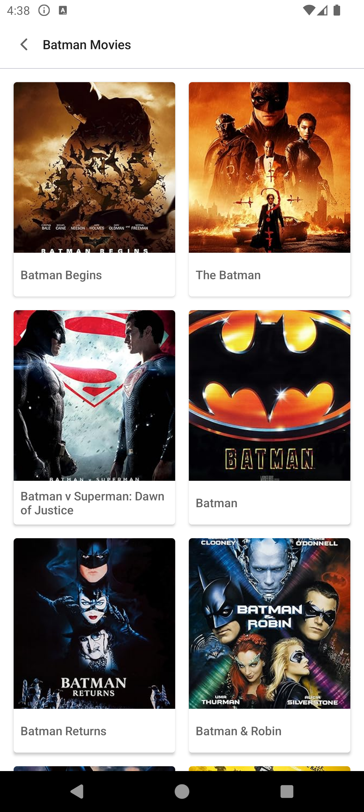
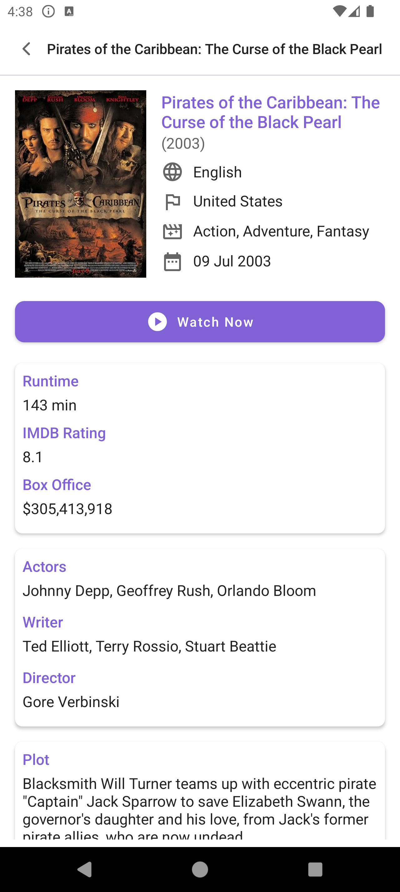
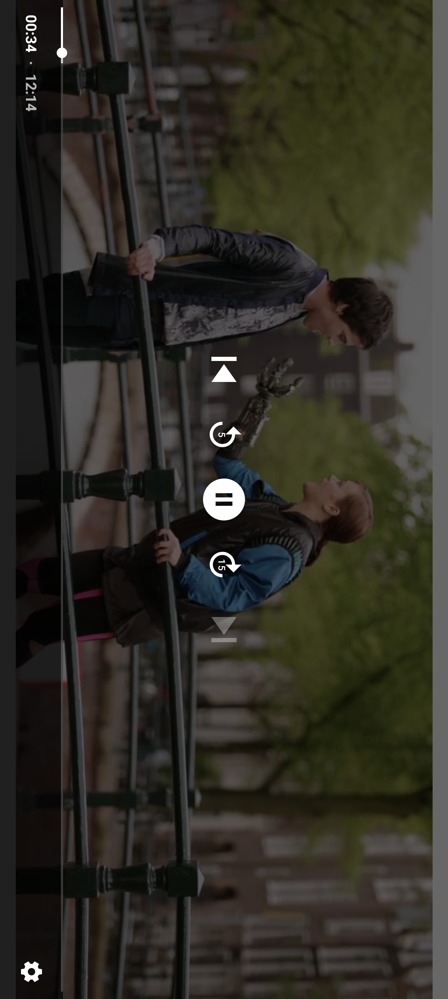
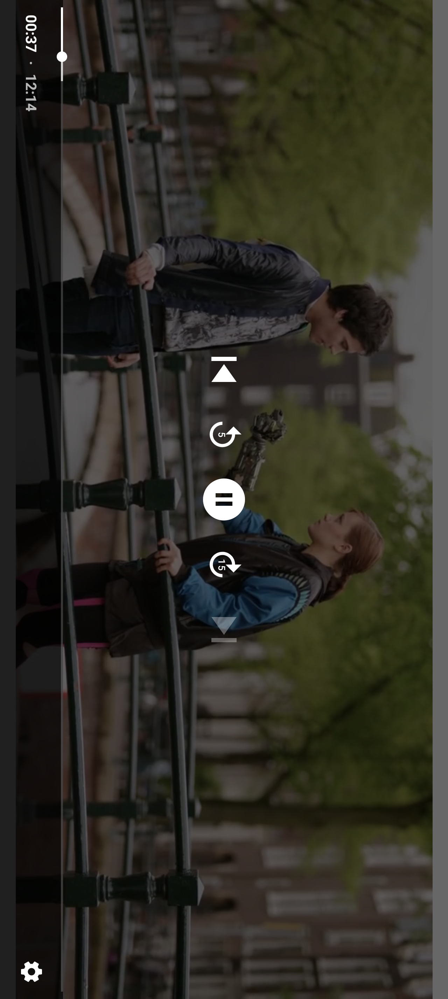

# OTTMovies
This is a simple movie app that allows users to view a list of movies and their details. The app is built using the MVVM architecture pattern and uses the OMDB API to fetch movie data. The app also uses the Media3 Exoplayer library to stream demo videos.

# How to run the app
### Direct Download and Install the APK
You can download the APK from the [app/release/app-release.apk](./app/release/app-release.apk) folder or from the [releases](https://github.com/ahmmedrejowan/OTTMovies/releases) section of this repository.
Install the APK on your Android device and run the app.

### Build the app from source
1. Clone the repository
2. Open the project in Android Studio
3. Build and run the app

> [!NOTE]
> Your Android Studio should be updated to the latest version to build the app from source. Android Studio Ladybug | 2024.2.1 Patch 3 is used to build the app.

# Project Details
- **Language**: Kotlin
- **IDE**: Android Studio Ladybug | 2024.2.1 Patch 3
- **Design**: XML
- **Architecture**: MVVM
- **Minimum SDK**: 24 (Android 7)
- **Target SDK**: 35 (Android 15)
- **Java Version**: 17
- **Kotlin Version**: 1.9.24

# Libraries Used
- **Retrofit**: For network requests
- **OkHttp Logging Interceptor**: For logging network requests
- **Glide**: For image loading
- **Exoplayer**: For streaming videos
- **Koin**: For dependency injection

# Features
#### Home Screen
- Displays a banner of movies
  - Displays 5 banners carousel
  - Automatically scrolls to the next banner
  - Clicking on a banner opens the movie details screen
- Displays list of Batman Movies
  - Displays movie poster, title
  - Clicking on a movie opens the movie details screen
  - Max 10 movies are displayed
  - See more button opens the movie list screen
- Displays list of Latest Movies (War movies from 2022 [See Limitation](#limitations))
  - Displays movie poster, title
  - Clicking on a movie opens the movie details screen
  - Max 10 movies are displayed
  - See more button opens the movie list screen
- Displays list of Mission Impossible Movies
  - Displays movie poster, title
  - Clicking on a movie opens the movie details screen
  - Max 10 movies are displayed
  - See more button opens the movie list screen

#### Movie List Screen (Home Page Tab)
- Displays list of War Movies
  - Displays movie poster, title
  - Clicking on a movie opens the movie details screen
  - Pagination is implemented, 10 movies are loaded at a time

#### Movie List Screen (See More Clicked)
- Displays list of movies
  - Displays movie poster, title
  - Clicking on a movie opens the movie details screen
  - Pagination is implemented, 10 movies are loaded at a time

#### Movie Details Screen
- Displays movie details
  - Movie poster, title, year, rating, runtime, genre, director, writer, actors, plot
  - Displays a demo video when clicked on the Watch Now button

#### Video Player Screen
- Displays the demo video
  - Opening this screen looks for existing video url and position for this movie id
  - If found then it plays that url from the stored position
  - If not, then it chooses a random video from the hardcoded list and starts playing it. I also adds the video url and position to the database
  - Video player with play, pause, seek options
  - Video player controls are hidden when inactive
  - Shows in fullscreen landscape mode
  - Stores the video position when the app is closed and resumes from the same position
  - If watched duration is 95% or more, video starts from the beginning when replayed

# Screenshots
| Home Screen                | Home Screen                | Movie List Screen          |
|----------------------------|----------------------------|----------------------------|
|  |  |  |

| Movie Details Screen       | Video Player Screen        | Video Player Screen       |
|----------------------------|----------------------------|---------------------------|
|  |  |  |

# Limitations
#### API Limitation
- The OMDB API does not provide a direct API endpoint for fetching movies by year. There is only search endpoint which requires a query as mandatory parameter. So, the app fetches movies by searching for the keyword "war" and "mission impossible" and then filters the movies by year in the app. This is why the app displays war movies from 2022 for latest movies.
- The API only provides 10 search results at a time. So, the app fetches 10 movies at a time and implements pagination to fetch more movies.
- All the list that are shown in the app are hardcoded in the app. The app fetches the movie list from the API and filters the movies by the hardcoded list.

#### Database
- The app does not use a local database to store the fetched movies. The app fetches the movies from the API every time the app is opened.
- The app stores the video position using SQLite database. SQLite is preferred over Room database because the app does not require complex queries and Room database is not needed for this simple use case.

